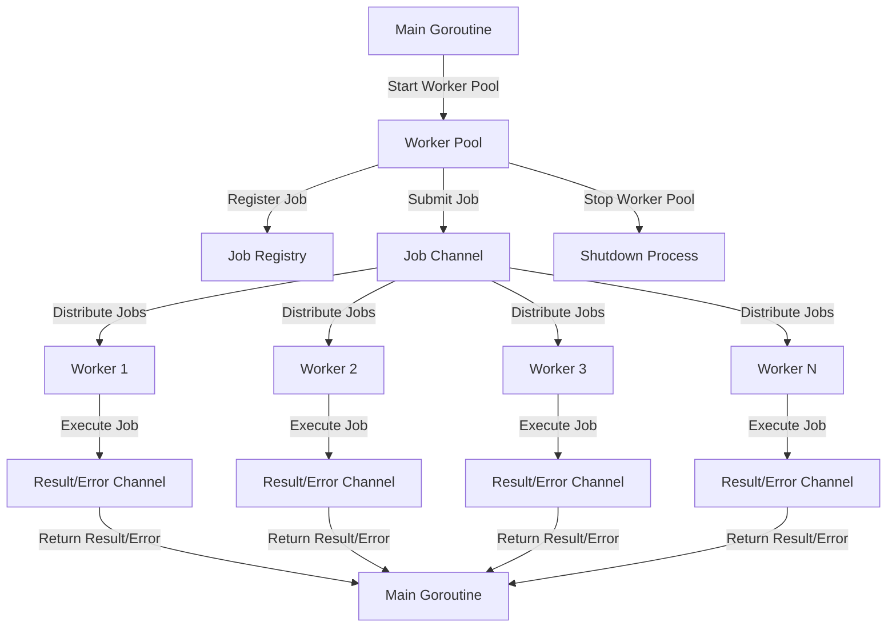
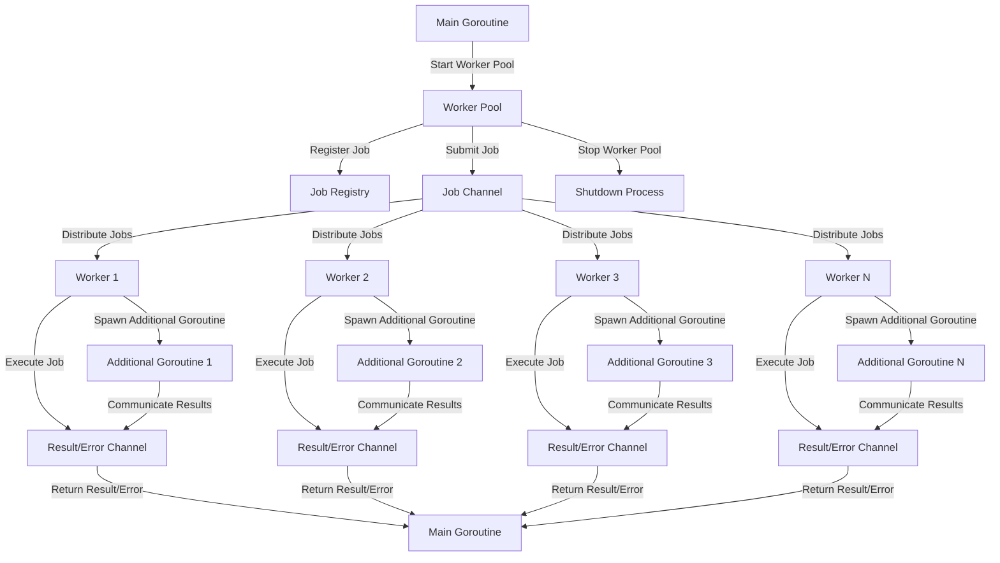

# K8s Deployment for REST API Boilerplate - Smooth Sailing ⛵ ☸

<p align="center">
   
</p>

This repository contains Kubernetes (K8s) deployment files for a REST API boilerplate application. The deployment includes configurations for the REST API service, Ingress controller, and Horizontal Pod Autoscaler (HPA).

## Prerequisites

Before deploying the application, ensure that you have the following:

- A running Kubernetes cluster
- `kubectl` command-line tool installed and configured to communicate with your cluster
- A container image for the REST API application

> [!NOTE]
> Since this deployment supports `100% HPA`, which is suitable for handling billions of requests/workers (combined with [worker package](https://github.com/H0llyW00dzZ/My-RESTAPIs-Boilerplate/tree/master/worker)) `concurrently and efficiently`, it is recommended not to attach it with any `storage (PVC, PV)` to this deployment.
> This is because HPA is not `100% compatible` if the deployment has `storage (PVC, PV) attached due to its limitations`, unless you build your own `storage mechanism` that can be shared among multiple pods (e.g., `capable of up to 1K Pods or more that consider supports 100% HPA`) while this deployment handles billions of requests/workers `concurrently and efficiently`.

## Deployment

To deploy the REST API boilerplate application using the provided K8s deployment files, follow these steps:

1. Update the `restapis-deploy.yaml` file with your desired configuration, such as the number of replicas, resource limits, and environment variables. Replace `<IMAGE_HERE>` with the actual container image for your REST API application.

2. Create the necessary secrets for the deployment:

   ```sh
    ./create_k8s_secret.sh
   ```

   Replace the placeholders with your actual values for database connections, Redis connections, timeouts, and other environment variables required by your REST API application.

3. Apply the deployment file to your Kubernetes cluster:

   ```bash
   kubectl apply -f restapis-deploy.yaml
   ```

   This command will create the necessary namespace, deployment, service, and HPA for the REST API application.

4. Update the `restapis-ingress.yaml` file with your desired configuration, such as the host name, TLS certificate, and paths for the REST API routes and frontend routes.

5. Apply the Ingress configuration to your Kubernetes cluster:

   ```bash
   kubectl apply -f restapis-ingress.yaml
   ```

   This command will create the Ingress resource for routing traffic to the REST API service.

6. Wait for the deployment to complete and the pods to be in the "Running" state:

   ```bash
   kubectl get pods -n restapis
   ```

7. Access the REST API service using the configured host name and paths specified in the Ingress configuration.

## Monitoring and Scaling

The provided deployment includes a Horizontal Pod Autoscaler (HPA) configuration that automatically scales the number of replicas based on CPU and memory utilization. You can monitor the HPA and the deployment using the following commands:

```bash
kubectl get hpa -n restapis
kubectl get deployment -n restapis
```

> [!NOTE]
> This example shows how `Horizontal Pod Autoscaler (HPA)` works properly, handling billions of requests/workers (combined with the [worker package](https://github.com/H0llyW00dzZ/My-RESTAPIs-Boilerplate/tree/master/worker)) `concurrently and efficiently`:

- **Events:**

```
12m         Normal   SuccessfulRescale   horizontalpodautoscaler/senior-golang-worker-hpa   New size: 14; reason: cpu resource utilization (percentage of request) below target
58m         Normal   SuccessfulRescale   horizontalpodautoscaler/senior-golang-worker-hpa   New size: 17; reason: cpu resource utilization (percentage of request) above target
12m         Normal   ScalingReplicaSet   deployment/senior-golang-worker                    Scaled down replica set senior-golang-worker-84bcb968 to 14 from 17
58m         Normal   ScalingReplicaSet   deployment/senior-golang-worker                    Scaled up replica set senior-golang-worker-84bcb968 to 17 from 14
```

- **Describe HPA:**

```
Name:                                                  senior-golang-worker-hpa
Namespace:                                             senior-golang-worker
Labels:                                                <none>
Annotations:                                           <none>
CreationTimestamp:                                     Wed, 11 Sep 2024 19:44:05 +0700
Reference:                                             Deployment/senior-golang-worker
Metrics:                                               ( current / target )
  resource cpu on pods  (as a percentage of request):  76% (268m) / 80%
Min replicas:                                          1
Max replicas:                                          30
Deployment pods:                                       14 current / 14 desired
Conditions:
  Type            Status  Reason              Message
  ----            ------  ------              -------
  AbleToScale     True    ReadyForNewScale    recommended size matches current size
  ScalingActive   True    ValidMetricFound    the HPA was able to successfully calculate a replica count from cpu resource utilization (percentage of request)
  ScalingLimited  False   DesiredWithinRange  the desired count is within the acceptable range
Events:
  Type    Reason             Age                   From                       Message
  ----    ------             ----                  ----                       -------
  Normal  SuccessfulRescale  60m (x5 over 34h)     horizontal-pod-autoscaler  New size: 17; reason: cpu resource utilization (percentage of request) above target
  Normal  SuccessfulRescale  14m (x12 over 2d23h)  horizontal-pod-autoscaler  New size: 14; reason: cpu resource utilization (percentage of request) below target
```

- **Watching HPA (Stable for long-running (Smooth Sailing ⛵ ☸) processes in combination with [`worker package`](https://github.com/H0llyW00dzZ/My-RESTAPIs-Boilerplate/tree/master/worker)):**

```
b0zal@Linux:~$ kubectl get hpa --watch
        NAME                           REFERENCE                TARGETS    MINPODS   MAXPODS   REPLICAS    AGE
senior-golang-worker-hpa   Deployment/senior-golang-worker   cpu: 75%/80%   1         30        22         18d
senior-golang-worker-hpa   Deployment/senior-golang-worker   cpu: 78%/80%   1         30        22         18d
senior-golang-worker-hpa   Deployment/senior-golang-worker   cpu: 68%/80%   1         30        22         18d
senior-golang-worker-hpa   Deployment/senior-golang-worker   cpu: 66%/80%   1         30        22         18d
senior-golang-worker-hpa   Deployment/senior-golang-worker   cpu: 54%/80%   1         30        22         18d
senior-golang-worker-hpa   Deployment/senior-golang-worker   cpu: 64%/80%   1         30        22         18d
senior-golang-worker-hpa   Deployment/senior-golang-worker   cpu: 34%/80%   1         30        22         18d
senior-golang-worker-hpa   Deployment/senior-golang-worker   cpu: 71%/80%   1         30        22         18d
senior-golang-worker-hpa   Deployment/senior-golang-worker   cpu: 76%/80%   1         30        22         18d
senior-golang-worker-hpa   Deployment/senior-golang-worker   cpu: 75%/80%   1         30        22         18d
senior-golang-worker-hpa   Deployment/senior-golang-worker   cpu: 65%/80%   1         30        22         18d
senior-golang-worker-hpa   Deployment/senior-golang-worker   cpu: 68%/80%   1         30        22         18d
senior-golang-worker-hpa   Deployment/senior-golang-worker   cpu: 61%/80%   1         30        22         18d
senior-golang-worker-hpa   Deployment/senior-golang-worker   cpu: 57%/80%   1         30        22         18d
senior-golang-worker-hpa   Deployment/senior-golang-worker   cpu: 25%/80%   1         30        22         18d
senior-golang-worker-hpa   Deployment/senior-golang-worker   cpu: 17%/80%   1         30        22         18d
senior-golang-worker-hpa   Deployment/senior-golang-worker   cpu: 53%/80%   1         30        22         18d
senior-golang-worker-hpa   Deployment/senior-golang-worker   cpu: 76%/80%   1         30        22         18d
```

The `cpu: 78%/80%` going `up/down` and `REPLICAS 22` are `dynamic` (depending on how many tasks/jobs are processed by the [`worker package`](https://github.com/H0llyW00dzZ/My-RESTAPIs-Boilerplate/tree/master/worker)) and not caused by the `cluster` itself or the `kernel`. It is suitable for [cluster autoscaler](https://github.com/kubernetes/autoscaler/tree/master/cluster-autoscaler) (auto-pilot).

> [!WARNING]  
> There is also a `warning` regarding the [cluster autoscaler](https://github.com/kubernetes/autoscaler/tree/master/cluster-autoscaler) (auto-pilot). When using the [CA](https://github.com/kubernetes/autoscaler/tree/master/cluster-autoscaler) (auto-pilot) in the cluster, consider not explicitly specifying [`node selectors`](https://kubernetes.io/docs/concepts/scheduling-eviction/assign-pod-node/#nodeselector) for each `deployment/pod`, as it can make it difficult for the [CA](https://github.com/kubernetes/autoscaler/tree/master/cluster-autoscaler) (auto-pilot) to maintain the nodes (e.g., `self-healing`, `detach nodes when no longer needed`).

> [!NOTE]
> It's important to note that `Horizontal Pod Autoscaler (HPA)` can be used with various types of software and applications, including `websites` and `game servers`, as long as they are deployed as pods in a Kubernetes cluster. The choice between `HPA` and `Vertical Pod Autoscaler (VPA)` depends on the specific requirements and characteristics of the workload. For example, for a `game server` [Counter-Strike 2](https://www.counter-strike.net/cs2) `Community Servers`, the stability and performance may depend on factors such as server hardware, network infrastructure, and configuration (if you have a deep understanding of Kubernetes, this can be easily managed), rather than solely on the use of `HPA` or `VPA`. Based on personal experience hosting a [Counter-Strike 2](https://www.counter-strike.net/cs2) `game server` fully managed and isolated by `Kubernetes`, it was found to be more stable than the official servers provided by `Steam` or `Faceit`.

Adjust the HPA configuration in the `restapis-deploy.yaml` file to suit your application's scaling requirements.

- **Average CPU (on AMD) and Memory Usage When Idle (as viewed on Grafana):**

<p align="center">
   
   
   
</p>

> [!NOTE]
> The `Average CPU and Memory Usage When Idle` refers to the state when no jobs are being processed by the [`worker package`](https://github.com/H0llyW00dzZ/My-RESTAPIs-Boilerplate/tree/master/worker).
> This also reflects the average usage of a typical Fiber application, as Fiber is designed with zero memory allocation in mind.

- **Average CPU (on AMD) and Memory Usage During Smooth Sailing ⛵ ☸ in Combination with the [`worker package`](https://github.com/H0llyW00dzZ/My-RESTAPIs-Boilerplate/tree/master/worker) (as viewed on Grafana):**

<p align="center">
   
   
   
</p>

As you can see, the memory usage is dynamic yet `stable and predictable`, unlike static memory usage where CPU growth affects all memory uniformly. This ensures smooth sailing ⛵ ☸, thanks to a new Go package called [`Unique`](https://pkg.go.dev/unique).

> [!NOTE]
> Note that the memory usage is dynamic. For example, if one of the pods reaches 100 MiB, it will not increase further due to the built-in garbage collection mechanisms in [`Unique`](https://pkg.go.dev/unique). This makes the usage predictable. For instance, if there are 5 pods each using 100 MiB, the total would be 500 MiB. Additionally, memory is used because of the Horizontal Pod Autoscaler (HPA). It's not feasible to bind a disk to many pods, and even when some cloud providers support it, it's typically limited to a few pods and can be more expensive, unless you build your own capable storage mechanism to navigate these challenges effectively. Then it will be very smooth sailing, this a Black Pearl ship, by reducing memory usage to zero allocation.
>
> Furthermore, due to the dynamic nature of memory usage while using [`Unique`](https://pkg.go.dev/unique), it is particularly suitable for HPA because its RSS primarily reflects memory usage rather than cache usage. This contrasts with stateful applications, which require disk attachment and often necessitate deployment as a single pod.
>
> For control in combination with the [`worker package`](https://github.com/H0llyW00dzZ/My-RESTAPIs-Boilerplate/tree/master/worker), you only need to adjust CPU settings because the [`worker package`](https://github.com/H0llyW00dzZ/My-RESTAPIs-Boilerplate/tree/master/worker) consumes CPU due to its concurrency.
> The [`worker package`](https://github.com/H0llyW00dzZ/My-RESTAPIs-Boilerplate/tree/master/worker) can also be suitable if your Go package or function has minimal memory allocation, allowing you to focus primarily on CPU usage.

- **Average Network Usage During Smooth Sailing ⛵ ☸ (Over a network) in Combination with the [`worker package`](https://github.com/H0llyW00dzZ/My-RESTAPIs-Boilerplate/tree/master/worker) (as viewed on Grafana):**

<p align="center">
   
   
   
</p>

> [!NOTE]
> Note that the network `In`/`Out` usage has been very stable, with no drops or issues. Everything is well established ⛵.

- **Average CPU (on AMD) and Memory Usage During Smooth Sailing ⛵ ☸ in Combination with the [`worker package`](https://github.com/H0llyW00dzZ/My-RESTAPIs-Boilerplate/tree/master/worker) & [Immutable Tag](https://github.com/H0llyW00dzZ/My-RESTAPIs-Boilerplate/blob/master/backend/cmd/server/run_immutable.go) (as viewed on Grafana):**

<p align="center">
   
</p>

> [!NOTE]
> The average CPU and memory usage on AMD during smooth sailing ⛵ ☸, in combination with the [`worker package`](https://github.com/H0llyW00dzZ/My-RESTAPIs-Boilerplate/tree/master/worker) and the [Immutable Tag](https://github.com/H0llyW00dzZ/My-RESTAPIs-Boilerplate/blob/master/backend/cmd/server/run_immutable.go), shows small memory usage compared to the new [`Unique`](https://pkg.go.dev/unique) package, which consumes significantly more memory.

- **Average CPU (on AMD) and Memory Usage When Idle & [Immutable Tag](https://github.com/H0llyW00dzZ/My-RESTAPIs-Boilerplate/blob/master/backend/cmd/server/run_immutable.go) (as viewed on Grafana):**

<p align="center">
   
   
   
   
</p>

> [!NOTE]
> The `Average CPU (on AMD) and Memory Usage When Idle & Immutable Tag` refers to the state when no jobs are being processed by the [`worker package`](https://github.com/H0llyW00dzZ/My-RESTAPIs-Boilerplate/tree/master/worker).
> When comparing `Average CPU (on AMD) and Memory Usage When Idle (as viewed on Grafana)`, the primary difference is in `Memory Usage (Cache)`.

- **Average CPU (on AMD) and Memory Usage During Smooth Sailing ⛵ ☸ with the [`worker package`](https://github.com/H0llyW00dzZ/My-RESTAPIs-Boilerplate/tree/master/worker) and [Immutable Tag](https://github.com/H0llyW00dzZ/My-RESTAPIs-Boilerplate/blob/master/backend/cmd/server/run_immutable.go) for `24/7 Operation Zero Downtime` (as viewed on Grafana):**

<p align="center">
   
   
   
</p>

> [!NOTE]
> The average CPU (on AMD) and memory usage remains stable during continuous operation (Smooth Sailing ⛵ ☸) with the [`worker package`](https://github.com/H0llyW00dzZ/My-RESTAPIs-Boilerplate/tree/master/worker) and [Immutable Tag](https://github.com/H0llyW00dzZ/My-RESTAPIs-Boilerplate/blob/master/backend/cmd/server/run_immutable.go).
> Unlike `stateful configurations`, which can sometimes encounter `OOM` errors due to the need for `explicit node selectors` and `single pod deployment`, `stateless architectures are more stable`. This is the reason why using `stateful architectures` for web services is not recommended (bad); mastering Kubernetes involves leveraging stateless designs (good).
>
> Also note that `stateful architectures` are not as scalable (not possible 🤪) as stateless ones because they are typically stable only on a single node and cannot easily scale across multiple nodes.
> In a comparison between `stateful` and `stateless` architectures, `stateless` ones (win) are generally more scalable.


- **Stable Handling of 1 Million+ Keys in Redis (as shown in Redis Insight and my Custom Redis Stats mechanism):**

<p align="center">
   
   
</p>

> [!NOTE]
> The phrase `Stable Handling of 1 Million+ Keys (1 Million+ data) in Redis (as shown in Redis Insight and my Custom Redis Stats mechanism)` refers to a setup where MySQL stores important, persistent data, while Redis is used for temporary storage. The process works simply: if there's a cache miss in Redis, the data is queried from MySQL and then stored in Redis with a TTL (time-to-live). This way, subsequent requests can retrieve the data directly from Redis if it's available, avoiding repeated queries to MySQL.
>
> It's important to note that in a `stateful architecture`, achieving this level of scalability might not be possible 🤪. However, with a `stateless architecture` and `Horizontal Pod Autoscaling (HPA)`, it remains stable without `significant latency`.

## Customization

The provided deployment files are designed to be customizable. You can modify the resource limits, environment variables, and other configurations according to your application's needs. Additionally, you can adjust the Ingress configuration to match your desired routing rules and TLS settings.

## Tips

### K8S Network Performance

Here are some tips to boost/improve the network performance. These are well-known in GKE because most important components are already built-in, and you only need to enable them:

- GKE:

Enable [Dataplane V2 Observability](https://docs.cilium.io/en/stable/internals/hubble/)

> [!NOTE]
> It can also improve the security mechanism if you have a deep understanding of networking.
> Other cloud providers might be added later, as I don't have experience with them. Additionally, the K8s ecosystem is large, not small.

### REST API Concurrency with HPA

- **Install [Cluster Autoscaler (CA)](https://github.com/kubernetes/autoscaler/tree/master/cluster-autoscaler)**: If you are using **GKE Autopilot**, you do not need to install the CA manually, as it is managed for you.

To enhance REST API concurrency (in combination with the [`worker package`](https://github.com/H0llyW00dzZ/My-RESTAPIs-Boilerplate/tree/master/worker)) and improve HPA performance:

- Start with a small deployment (e.g., **1 node**), and set the **maximum CPU** to **350m** with **80% utilization** for the HPA. This strategy allows for scaling as demand increases.

#### Example of REST API Concurrency with HPA

```bash
b0zal@Linux:~$ kubectl get hpa
NAME                        REFERENCE                   TARGETS        MINPODS   MAXPODS   REPLICAS    AGE
senior-golang-worker-hpa   Deployment/senior-golang   cpu: 75%/80%      1         60        41         35d
```

> [!NOTE]
> In this example, the REST API ([This Repo](https://github.com/H0llyW00dzZ/My-RESTAPIs-Boilerplate)) is running with **22 vCPUs** (extremely scalable) across **8 nodes**, for **41 Pods**.

### Example of 80% Utilization for the HPA in Math ([`LaTeX`](https://en.wikipedia.org/wiki/LaTeX))

To understand how the utilization and vCPUs work together, consider the following calculations:

1. **Calculate total vCPUs used by Pods:**
   - Each pod uses **350m** (which is **0.35 vCPUs**).
   - With **41 Pods**, the total vCPUs used is:

$$
   \text{Total vCPUs} = 41 \text{ Pods} \times 0.35 \text{ vCPUs/Pod} = 14.35 \text{ vCPUs}
$$

2. **Calculate required vCPUs based on utilization:**
   - If you are targeting **80% utilization**, the required vCPUs can be calculated as:

$$
   \text{Required vCPUs} = \frac{\text{Total vCPUs}}{\text{Utilization}} = \frac{14.35}{0.80} \approx 17.94 \text{ vCPUs}
$$

This means that with **22 vCPUs** available, you have sufficient capacity to handle the load of **41 Pods** while maintaining an 80% utilization target.

### Well-Known Issue: `Connection Reset by Peer` When Running on Kubernetes (DigitalOcean)

##### How to Fix the Issue

To resolve the well-known issue `Connection Reset by Peer` when running on Kubernetes with DigitalOcean, modify your service for the NGINX Ingress (after installing it) using the following YAML:

```yaml
      meta.helm.sh/release-name: ingress-nginx
      meta.helm.sh/release-namespace: ingress-nginx
      service.beta.kubernetes.io/do-loadbalancer-enable-backend-keepalive: "true"
      service.beta.kubernetes.io/do-loadbalancer-enable-proxy-protocol: "true"
      service.beta.kubernetes.io/do-loadbalancer-hostname: api.example.com
      service.beta.kubernetes.io/do-loadbalancer-http-idle-timeout-seconds: "180"
      service.beta.kubernetes.io/do-loadbalancer-size-unit: "1"
      service.beta.kubernetes.io/do-loadbalancer-tls-passthrough: "true"
```

Make sure to modify the `service.beta.kubernetes.io/do-loadbalancer-hostname` within your REST APIs.

> [!NOTE]
> If you are using two load balancers (one for the database as a standalone without NGINX Ingress, and the second for the application), change `service.beta.kubernetes.io/do-loadbalancer-hostname` to `service.beta.kubernetes.io/do-loadbalancer-hostname: db.example.com` for the database. This will ensure proper connectivity and prevent "Connection Reset by Peer" errors.
>
> Additionally, the `Connection Reset by Peer` error can occur when pods cannot communicate with each other or with themselves. For example, if your pod's IP is `10.0.0.1` and you try to use `curl` to access it via `example.com`, which is bound to `10.0.0.1`, you may encounter the `Connection Reset by Peer` error. However, using `curl` directly to `10.0.0.1` would work properly. This issue can arise even within the same `virtual machine`.

### Setup DOKS External Load Balancer Hostname for Ingress-NGINX

To set up a DOKS external load balancer hostname that allows pods to communicate and prevents the error `Connection Reset by Peer`, follow these steps. This setup enables any domain based on DNS.

1. Ensure you replace `service.beta.kubernetes.io/do-loadbalancer-hostname: api.example.com` with `service.beta.kubernetes.io/do-loadbalancer-hostname: host.example.com`:
   ```yaml
   service.beta.kubernetes.io/do-loadbalancer-hostname: host.example.com
   ```

2. In `host.example.com`, set the [DNS A record](https://www.cloudflare.com/learning/dns/dns-records/dns-a-record/) with the IP of the ingress load balancer to `host.example.com`.

3. When creating multiple ingresses across different services, you don't need to set each domain to an IP address. Instead, use a [CNAME](https://www.cloudflare.com/learning/dns/dns-records/dns-cname-record/) record pointing to `host.example.com`.

> [!TIP]
> To enhance the hostname, you can create a random name, for example, using a SHA-256 digest, such as `936a185caaa266bb9cbe981e9e05cb78cd732b0b3280eb944412bb6f8f8f07af.example.com`.

### Enhance REST API Concurrency with HPA on DOKS Using an External Load Balancer for Ingress-nginx

To enhance REST API concurrency with HPA on DOKS using an external load balancer for `Ingress-nginx`.

Make sure you adjust the load balancer size unit as needed in the `nginx-ingress service` by following this YAML configuration:

```yaml
meta.helm.sh/release-name: ingress-nginx
meta.helm.sh/release-namespace: ingress-nginx
service.beta.kubernetes.io/do-loadbalancer-size-unit: "1"
```

For example, if you have multiple APIs (`e.g., api1.example.com, api2.example.com, api3.example.com`) in one `ingress-nginx service`, replace `service.beta.kubernetes.io/do-loadbalancer-size-unit: "1"` with `service.beta.kubernetes.io/do-loadbalancer-size-unit: "3"`.

> [!NOTE]
> In DOKS, you won't incur high costs for Kubernetes resources like nodes (`e.g., virtual machines known as Droplets`). Based on my personal experience, most spending is for the load balancer, as it efficiently manages resource usage such as `CPU and memory`.

### Set Up HTTPS/TLS on DOKS for Ingress-nginx Across Multiple Services in One Ingress-nginx

To set up HTTPS/TLS on DOKS for Ingress-nginx across multiple services in one ingress-nginx, for example with [`cert-manager.io`](https://cert-manager.io/), follow these steps after resolving the `Connection Reset by Peer` issue:

- [x] [Well-Known Issue: `Connection Reset by Peer` When Running on Kubernetes (DigitalOcean)](RESTAPIs.md#well-known-issue-connection-reset-by-peer-when-running-on-kubernetes-digitalocean)
- [x] [Setup DOKS External Load Balancer Hostname for Ingress-NGINX](RESTAPIs.md#setup-doks-external-load-balancer-hostname-for-ingress-nginx)

Once resolved, you can set up HTTPS/TLS easily without further issues.

For setting up HTTPS/TLS, I personally don't use [`cert-manager.io`](https://cert-manager.io/) because I already have a certificate issued by [`sectigo.com`](https://www.sectigo.com/). The certificate is a wildcard and uses [ECC](https://en.wikipedia.org/wiki/Elliptic-curve_cryptography).

For example, the certificate I've been using:

- [Certificate Transparency Log](https://crt.sh/?q=d5b8a29e3eaf7413ee925dbb2ee9c9f9b6a73880fe0444704baaf71c1aa7feb3)

> [!NOTE]
> The current certificate I am using is `highly trustworthy`, reflecting a healthy ecosystem, as indicated by the Certificate Transparency Log linked above.

> [!TIP]
> Since this repository supports HTTPS/TLS with certificates issued by [cert-manager.io](https://cert-manager.io/) by binding the TLS secrets provided by cert-manager.io. For a sample deployment, see [here](https://github.com/H0llyW00dzZ/My-RESTAPIs-Boilerplate/blob/master/k8s-deployment/restapis-deploy.yaml).
> This setup allows for HTTPS/TLS without terminating at ingress-nginx. I personally use this method without cert-manager.io (I already have a certificate issued by [`sectigo.com`](https://www.sectigo.com/)) to avoid concurrency issues.

### Set Up Deployment with the `immutable` Tag for HPA in Combination with the [`worker package`](https://github.com/H0llyW00dzZ/My-RESTAPIs-Boilerplate/tree/master/worker)

To set up a deployment with the `immutable` tag for HPA in combination with the [`worker package`](https://github.com/H0llyW00dzZ/My-RESTAPIs-Boilerplate/tree/master/worker), it depends on how suitable your workloads are based on the [default example deployment](https://github.com/H0llyW00dzZ/My-RESTAPIs-Boilerplate/blob/master/k8s-deployment/restapis-deploy.yaml):

```yaml
resources:
  requests:
    memory: "359Mi"
    cpu: "350m"
  limits:
    memory: "512Mi"
    cpu: "500m"
```

If your workloads are not suitable within the [default example deployment](https://github.com/H0llyW00dzZ/My-RESTAPIs-Boilerplate/blob/master/k8s-deployment/restapis-deploy.yaml), adjust `cpu: "350m"`; for example, you might replace it with `cpu: "450m"`, while keeping `HPA` configured as follows:

```yaml
apiVersion: autoscaling/v2
kind: HorizontalPodAutoscaler
metadata:
  # Note: You can modify the namespace and name later as needed.
  name: restapis-hpa
  namespace: restapis
spec:
  scaleTargetRef:
    apiVersion: apps/v1
    kind: Deployment
    name: restapis
  minReplicas: 1
  maxReplicas: 50
  metrics:
  - type: Resource
    resource:
      name: cpu
      target:
        type: Utilization
        averageUtilization: 80
  - type: Resource
    resource:
      name: memory
      target:
        type: Utilization
        averageUtilization: 80
```

> [!NOTE]
> Don't forget to set `maxReplicas: 50` based on your needs; for example, you can reduce it to `maxReplicas: 5` for a starter configuration.

> [!TIP]
> You can also adjust the HPA based on custom metrics, such as HTTP requests, using `Prometheus` and the `Prometheus Adapter` for example:
>
> ```yaml
> apiVersion: autoscaling/v2
> kind: HorizontalPodAutoscaler
> metadata:
>   name: restapis-hpa
>   namespace: restapis
> spec:
>   scaleTargetRef:
>     apiVersion: apps/v1
>     kind: Deployment
>     name: restapis
>   minReplicas: 1
>   maxReplicas: 5
>   metrics:
>     - type: Pods
>       pods:
>         metric:
>           name: http_requests_per_second
>         target:
>           type: AverageValue
>           averageValue: "100"
> ```
>
> Note that I haven't personally tested custom metrics, as it's already stable with the [`worker package`](https://github.com/H0llyW00dzZ/My-RESTAPIs-Boilerplate/tree/master/worker). Therefore, custom metrics might not be stable.

> [!WARNING]
> When using the `immutable` tag with HPA in combination with the [`worker package`](https://github.com/H0llyW00dzZ/My-RESTAPIs-Boilerplate/tree/master/worker) or outside Kubernetes, avoid using mutexes again for concurrency. This can degrade performance because the `worker package` already synchronizes using channels. Ensure your functions are immutable/safe for concurrency, even with a large number of workers (e.g., millions or billions of goroutines). They will `efficiently` process jobs by doing `one thing and doing it well`.

For example, how the [`worker package`](https://github.com/H0llyW00dzZ/My-RESTAPIs-Boilerplate/tree/master/worker) works:



Note that in the worker package, it is also possible to spawn additional goroutines to communicate with the worker itself. For example:



There are no limitations; it can be used across a large codebase with synchronization. The only limitation might be whether the CPU is capable of handling a large number of workers.

### Prevent OOM Errors with HPA When There Are Many Pods on a Node (Rare Issue)

To prevent Out of Memory (OOM) errors in Kubernetes, especially when using `Horizontal Pod Autoscaler (HPA)`, consider the following strategies:

1. **Node Sizing and Node Pools**: 
   - Ensure your nodes have sufficient memory to handle the maximum number of pods expected. This can involve creating a node pool with larger nodes or more nodes to distribute the load.
   - For specific cloud providers like `DigitalOcean Kubernetes Service (DOKS)`, you can configure node pools to match your workload needs.

2. **GKE Autopilot**:
   - In `Google Kubernetes Engine (GKE)`, using `GKE Autopilot` can help manage resources automatically, optimizing for both cost and performance. Autopilot handles node provisioning and scaling, which can help mitigate OOM issues.

3. **Resource Requests and Limits**:
   - Properly set resource requests and limits for your pods. This ensures that Kubernetes schedules pods on nodes with enough available resources and prevents a single pod from consuming all resources on a node.

4. **Monitoring and Alerts**:
   - Implement monitoring and alerting to detect OOM events or high memory usage early. Tools like Prometheus and Grafana can help visualize and alert on resource usage.

5. **Application Optimization**:
   - Optimize your applications to use memory efficiently. Sometimes, OOM errors are due to memory leaks or inefficient memory usage in the application code.

> [!NOTE]
> The mention of GCC and Go seems unrelated to OOM errors in Kubernetes. Typically, OOM errors in Kubernetes are more about resource allocation and management rather than compilation settings. Ensure your applications are built with appropriate settings, but focus on Kubernetes resource configurations to handle OOM issues.

## Compatibility

Since this boilerplate uses the [`Fiber Framework`](https://gofiber.io/), it's important to note that not all configurations in `ingress-nginx` are supported. For example, if you set `annotations` in the ingress service of this boilerplate, such as the following YAML:

```yaml
nginx.ingress.kubernetes.io/backend-protocol: HTTPS
nginx.ingress.kubernetes.io/force-ssl-redirect: true
nginx.ingress.kubernetes.io/ssl-passthrough: true
nginx.ingress.kubernetes.io/session-cookie-max-age: 600
nginx.ingress.kubernetes.io/session-cookie-name: cookie
nginx.ingress.kubernetes.io/session-cookie-samesite: Strict
```

The annotations `nginx.ingress.kubernetes.io/session-cookie-max-age`, `nginx.ingress.kubernetes.io/session-cookie-name`, and `nginx.ingress.kubernetes.io/session-cookie-samesite` are not supported. If you explicitly set these three, the services in this repository may become unreachable because Fiber has strict validation for headers. Therefore, it is better to remove these annotations and instead use the cookie mechanism that is already implemented in this [`repository`](https://docs.gofiber.io/api/middleware/session).

> [!TIP]
> The [Session/Cookie](https://docs.gofiber.io/api/middleware/session) mechanism in the [`Fiber Framework`](https://gofiber.io/) 
> is compatible with `HPA` (Horizontal Pod Autoscaling) for large-scale applications + multiple sites in single deployment, as long as you do not use the storage option that relies on [`direct memory`](https://docs.gofiber.io/storage/memory_v2.x.x/memory/).

> [!WARNING]
> While this boilerplate uses the [`Fiber Framework`](https://gofiber.io/), it is compatible with `HPA` (Horizontal Pod Autoscaling) for large-scale applications and multiple sites in a single deployment. 
> Do not switch the deployment to `stateful (bad)`, as `stateful (bad)` deployments limit your ability to leverage Kubernetes features and experimental solutions for addressing critical infrastructure issues.

## Compliance

This boilerplate is compliant with autoscaling features in various cloud providers. For example:

- **GKE Autopilot**: This deployment is fully compatible with GKE Autopilot's autoscaling capabilities.
- **DOKS (DigitalOcean Kubernetes Service)**: The configuration is also suitable for autoscaling in DOKS.

By adhering to best practices for Horizontal Pod Autoscaler (HPA) and ensuring proper resource management, this boilerplate can efficiently handle scaling requirements in cloud environments.

> [!NOTE]
> Compliance is provided by default by the cloud providers, so there's no need for manual installation or configuration.
> If a cloud provider requires you to install or configure components manually for autoscaling, it may not be compatible with this boilerplate.
> This boilerplate is designed to minimize overhead (be smart), avoiding the need for manual configuration of policies or tools for autoscaling.

## Cleanup

To remove the deployed resources from your Kubernetes cluster, run the following commands:

```bash
kubectl delete -f restapis-ingress.yaml
kubectl delete -f restapis-deploy.yaml
```

This will delete the Ingress resource, deployment, service, and HPA associated with the REST API application.
